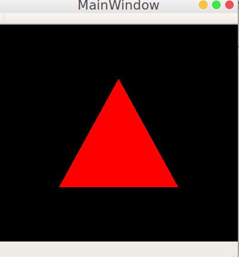
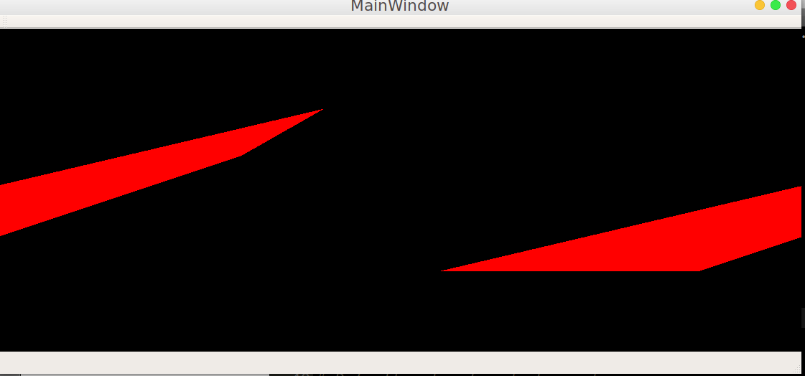

# GlReadPixelsQT
I want to render opengl into a QImage.Want to use glfw and glew for opengl context &amp; extensions,not Qt's

# Before resizing, everything renders fine

# After resizing, image doesnt scale properly.Don't know if it is opengl's fault or qt's

