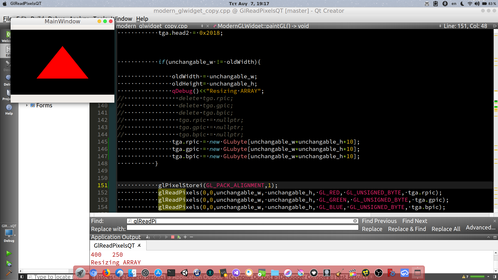
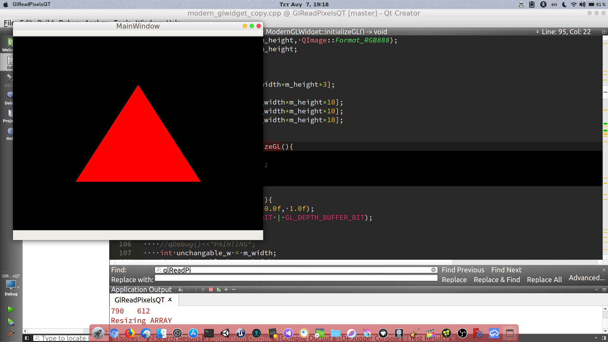
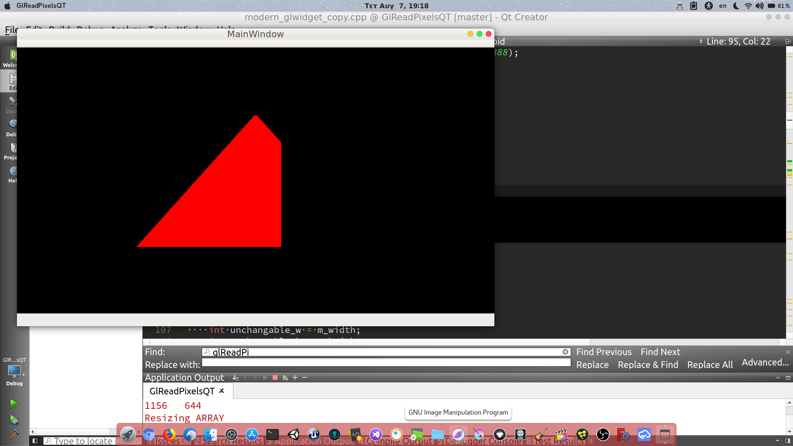
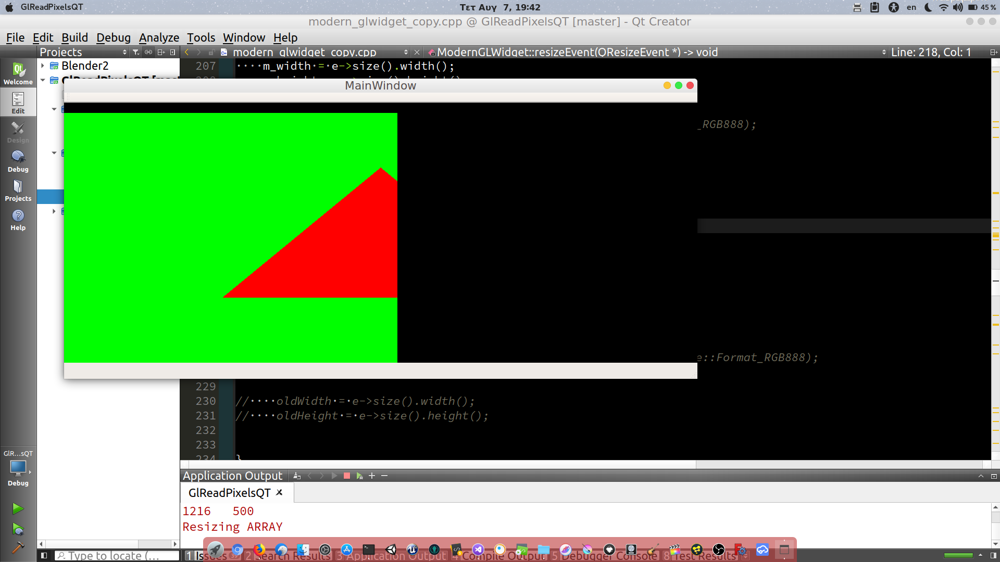
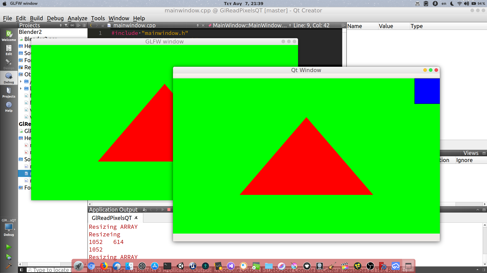

# GlReadPixelsQT
I want to render opengl into a QImage.Want to use glfw and glew for opengl context &amp; extensions,not Qt's

# Before resizing, everything renders fine

# After resizing, image doesnt scale properly.Don't know if it is opengl's fault or qt's

# Correct with the addition of glPixelStorei(GL_PACK_ALIGNMENT,1)

# Resizing a bit-correct

# Resizing more horizontally cuts the triangle horizontally

# Image is with green background now

# Calling glfwSetWindowSize(window,m_width,m_height); in resizeEvent of Qt fixed it

